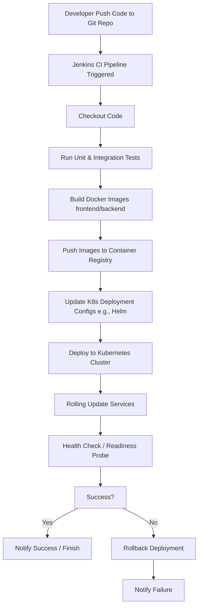

# k8s-cicd-automation


```mermaid
flowchart TD
  A[Developer Push Code to Git Repo] --> B[Jenkins CI Pipeline Triggered]
  B --> C[Checkout Code]
  C --> D[Run Unit & Integration Tests]
  D --> E[Build Docker Images frontend/backend]
  E --> F[Push Images to Container Registry]
  F --> G[Update K8s Deployment Configs e.g., Helm]
  G --> H[Deploy to Kubernetes Cluster]
  H --> I[Rolling Update Services]
  I --> J[Health Check / Readiness Probe]
  J --> K[Success?]
  K -- Yes --> L[Notify Success / Finish]
  K -- No --> M[Rollback Deployment]
  M --> N[Notify Failure]
```

```
sudo apt update
sudo apt install -y kubectl
```